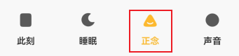
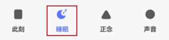
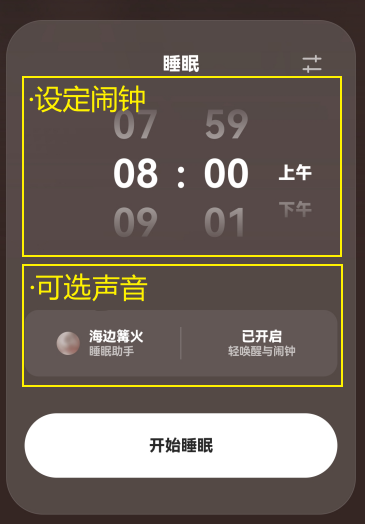
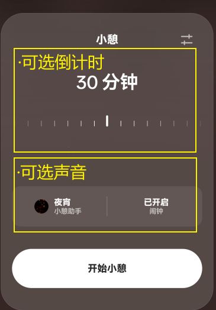
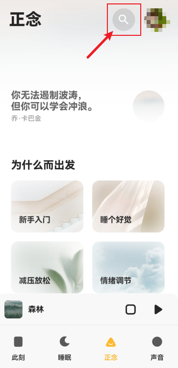
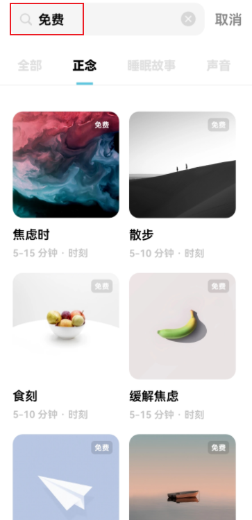
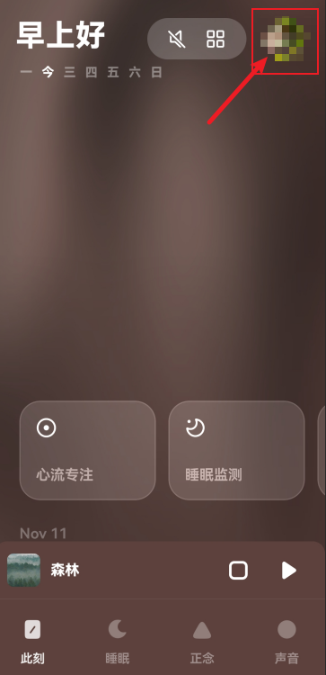
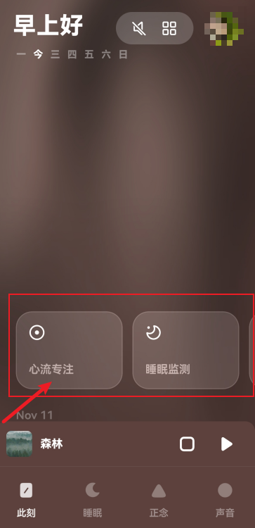
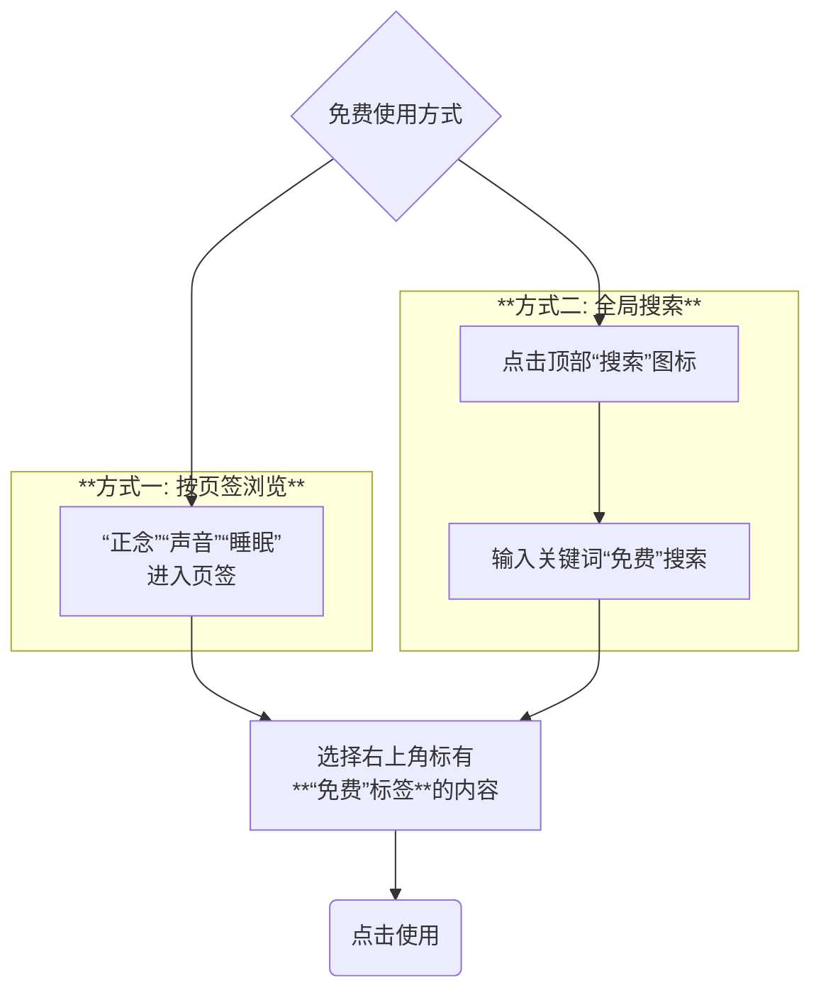

# 潮汐App免费版使用指南

> 摘要：本文档为不想订阅会员的用户，详细介绍潮汐App中所有可免费使用的功能，帮助您无需付费也能有效进行专注、冥想和睡眠。

---

## 1. 免费版能做什么？

- **核心价值**：可使用**专注、冥想、睡眠、呼吸练习**等所有核心功能。
- **适合人群**：工作/学习专注、冥想入门、睡眠提升、寻找高质白噪音的用户。
- **与付费版的区别**：免费版在冥想课程、声音场景、睡眠故事等**内容上有所限制**。

## 2. 开始前

- **支持设备**：iOS/Android**手机**客户端、**电脑**网页端。
- **开通权限**：需要**互联网连接**以访问内容；建议**开启通知权限**以接收提醒。
- **免费注册**：支持QQ、微信、微博、邮箱、手机号，或华为、小米、iOS等系统账户，一键注册。

## 3. 免费功能详解

### 3.1 声音专注

- **功能入口**：App底部导航栏的 **“声音”** 页签。
  
    ​		
    
    - 选择右上角标有 **“免费”** 标签的内容。
    
- **免费内容**：包含24种**白噪音**，可用于专注、放松。并支持自定义时长。
  
    - 海洋、雨天、冥想、森林、雷雨、绵雨、她的城市、图书馆、长路、麦浪、流水、夏夜、咖啡、序章、瀑布、雪山、时钟、猫的午后、风扇、键盘、铅笔、家宴、夜宵、篮球场（按使用热度排序）

### 3.2 正念冥想

- **功能入口**：App底部导航栏的 **“正念”** 页签。

  ​	

  + 选择右上角标有 **“免费”** 标签的内容。

- **免费内容**：包含17个完整的**冥想课程**，可跟随导师练习。
  
  - 焦虑时、散步、食刻、缓解焦虑、思危须鲇、缓解疲劳、减压、呼吸训练、身体到秒、视觉想象、情绪感知、早安、云上、情绪急救、晚安、午休、专注

### 3.3 睡眠辅助

- **功能入口**：App底部导航栏的 **“睡眠”** 页签。

    ​	

    + 选择右上角标有 **“免费”** 标签的内容。

- **睡眠故事**：包含6个免费故事，时长均为10~30分钟。
  
    - Z323次列车、沧浪亭、雨天、海洋、归来、我们为什么要睡觉
    
- **睡眠工具**：支持设定**睡眠（闹钟）**与**小憩（倒计时）**功能。可搭配免费声音场景使用。

​	

### 3.4 呼吸练习

- **功能入口**：App首页 **“此刻”** 的 **“呼吸法”** 卡片。
- **免费内容**：包含3种**呼吸训练模式**，通过震动与视觉提示引导练习。并支持自定义时长。
    - 平衡呼吸、4-7-8呼吸、箱式呼吸

## 4. 技巧与建议

### **精准搜索**

点击顶部“搜索”图标。

**输入“免费**”搜索全部免费内容。

​	   

### 离线使用

在Wi-Fi环境下，可提前点击内容旁的下载按钮。

下载后，可在“我的”→“离线内容”中随时使用，无需网络。

​	

### 快捷入口

善用“此刻”首页的快捷卡片，如“心流专注”、“睡眠监测”、“呼吸练习”，以实现快速启动。

​	

### 善用收藏

遇到喜欢的免费内容，点击收藏图标。

收藏后，可在各页签的“收藏”分类中，快速找到它们。

​		

### 功能组合

尝试组合不同功能以获得更佳体验。

例如：午休时使用【声音场景】营造氛围，睡前使用【正念冥想】帮助入眠。

### 流程指南

## 5. 常见问题

- **Q**: 免费版**广告**多吗？
  **A**: 应用内无任何广告干扰，不影响体验。只要您选择右上角标有“免费”标签的内容，即可获得纯净的体验。
- **Q**: 免费版的冥想课程是**完整**的吗？
  **A**: 所有免费冥想课程均为完整版本，可全程使用。
- **Q**: 不付费的话，**长期使用**价值大吗？
  **A**: 免费版内容虽有限，但每一件都品质优异。对于初学者或需求明确的用户而言，“少选项”反而有助于减少选择压力，更专注于体验本身，具备长期使用价值。