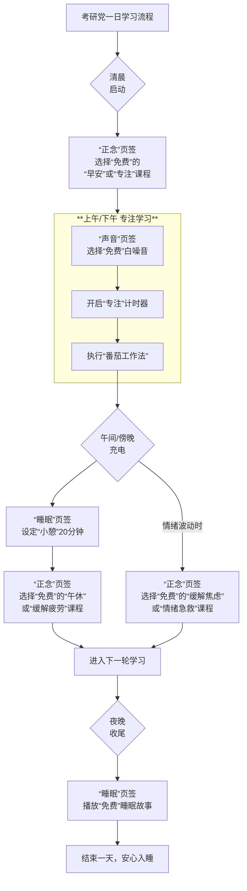

### **📚 考研党专属潮汐App免费版使用攻略**

> **核心思路**：潮汐免费版不是内容库，而是你**专注节奏的调节器**和**情绪稳定的护航者**。

#### **一、每日学习节奏与功能搭配**

你可以将一天的学习分为几个阶段，用潮汐的不同功能来辅助：

#### **二、核心功能场景化运用**

**1. 声音专注：打造深度学习的“背景墙”**

- **推荐免费声音**：
  - **图书馆、键盘、铅笔**：模拟学习氛围，激发代入感。
  - **雨天、海洋、流水**：隔绝宿舍/自习室杂音，营造稳定声场。
  - **时钟**：轻微的滴答声能强化时间流逝感，督促你保持节奏。
- **高阶用法**：尝试**组合声音**（如“键盘”+“雨天”），创造出你专属的沉浸式学习环境。

**2. 专注计时器：践行“番茄工作法”**

- **设定**：打开任意声音后，点击右上角计时器，建议设置为 **45-50分钟**（一个紧凑的番茄钟）。
- **价值**：在这段时间里，**不碰手机、不起身**，强制保持专注。倒计时本身也是一种正向激励。

**3. 正念冥想：学习状态的“复位键”**

- **晨起激活**：学习前花5分钟做 **“早安”或“专注”** 冥想，唤醒大脑，清晰当日目标。
- **学间调剂**：每个番茄钟结束后，用 **“缓解疲劳”** 课程的5分钟来放松眼睛和大脑，而非刷手机。
- **情绪急救**：当感到焦虑、压力大时（如做错题、记不住），立即做 **“缓解焦虑”或“情绪急救”** 课程，10分钟左右就能有效平复情绪，避免陷入内耗。

**4. 睡眠与小憩：保证精力的“蓄电池”**

- **午间小憩**：在“睡眠”页签使用 **“小憩”** 功能，设定20分钟，搭配“海洋”或“雨天”白噪音，快速恢复精力。
- **夜间助眠**：睡前不听专业课！使用 **“睡眠故事”**（如《Z323次列车》、《沧浪亭》），让大脑从学习模式中彻底脱离，保障高质量睡眠。

#### **三、给考研党的专属建议**

- **技巧一：固定流程，形成条件反射**
  - 每天在固定时间使用固定的功能组合，例如“早上的专注冥想 -> 上午的图书馆白噪音”。让身体和大脑形成“听到这个声音，就该学习了”的条件反射。
- **技巧二：善用收藏，构建个人武器库**
  - 把你常用的免费声音和冥想课程**全部收藏**。在“声音”、“正念”页签的“收藏”分类中，快速找到它们，避免每次花费时间寻找。
- **技巧三：提前下载，实现无缝使用**
  - 在宿舍/家里的Wi-Fi环境下，**提前下载**好所有你常用的免费内容。这样在图书馆、教室等网络不稳定的地方，也能随时使用，不受干扰。
- **技巧四：组合使用，1+1>2**
  - **举例**：感到学不进去时，先做一个5分钟的 **“减压”冥想** 清理杂念，再开启 **“时钟”白噪音** 进入专注状态。

**总结**：
对于考研党，潮汐免费版的核心价值在于**仪式感、节奏感和情绪稳定性**。它不能替你学习，但能为你创造一个**减少干扰、保持专注、及时调整**的最佳学习心理环境。用好这些免费功能，足以支撑你高效走完整个备考周期。